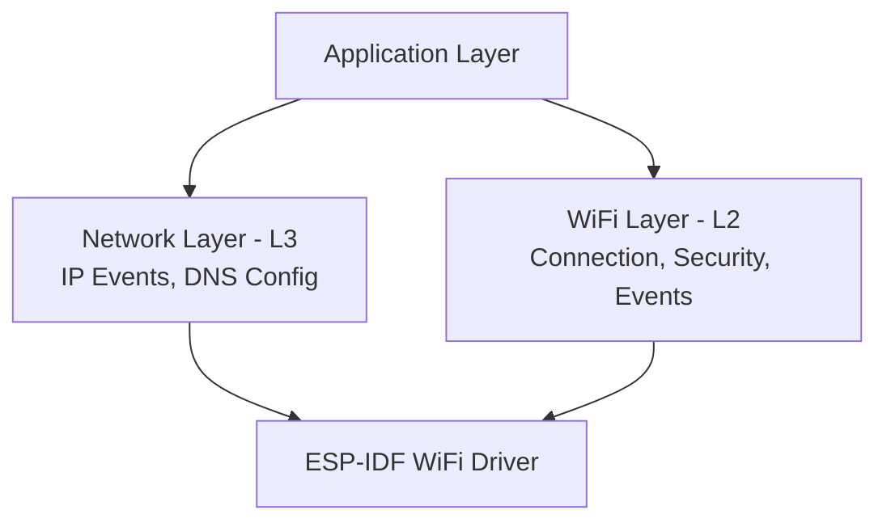

# Time to Build Your Own Connection Manager

### You've Seen the Magic ✨
- `example_connect()` got you connected instantly
- But what's happening inside that black box?
- What if you need custom behavior?

### Production-Ready Architecture

