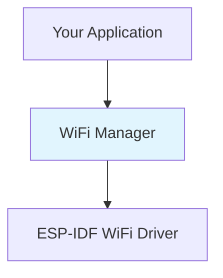

# WiFi Manager: Core Concepts

<div class="grid grid-cols-2 gap-8">

<div>



</div>

<div>

**Key Responsibilities:**
- 🔧 Configuration management
- 🔄 Connection lifecycle control  
- 📡 Event handling & monitoring
- 🛡️ Security policy enforcement

### Lifecycle Pattern
```
Init → Configure → Start → Monitor → Destroy
```

**Why This Pattern?**
- **Predictable**: Clear state progression
- **Testable**: Each phase can be validated
- **Robust**: Proper resource management
- **Flexible**: Can pause/resume as needed

</div>

</div>

