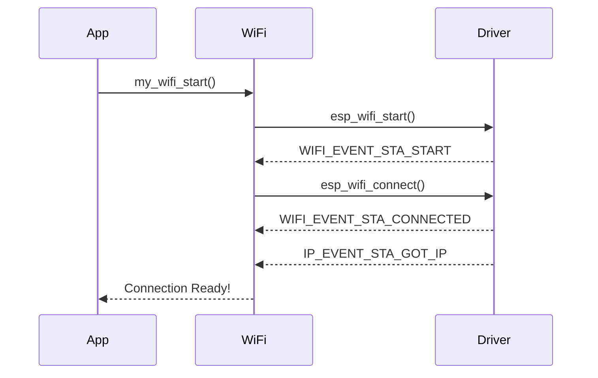

# WiFi Events: Understanding the Flow

<div class="grid grid-cols-2 gap-8">

<div>

### Event-Driven Programming

**WiFi operates asynchronously - events tell you what happened**



</div>

<div>

### Why Events Matter

- **Asynchronous**: WiFi connection takes time
- **Stateful**: Track connection progress  
- **Reactive**: Respond to network changes

### Connection State Management

```text
[IDLE] → [CONNECTING] → [CONNECTED] → [MONITORING]
   ↑                                        ↓
   ←──────────[DISCONNECTED]←──────────────┘
```

**Event-driven state transitions enable:**
- Non-blocking operations
- Real-time status updates
- Intelligent retry logic
- Security monitoring

</div>

</div>
