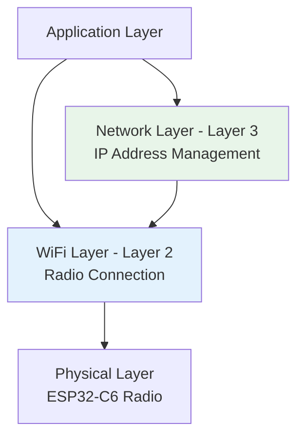

# Network Layer: Separation of Concerns

<div class="grid grid-cols-2 gap-8">

<div>



**Layer 2 (Data Link) - WiFi Manager:**
- Association with Access Point
- Authentication and encryption
- Radio link quality monitoring

**Layer 3 (Network) - Network Manager:**
- IP address assignment (DHCP)
- Gateway and DNS configuration
- Network connectivity status

</div>

<div>

### Why Separation Matters
```
WiFi Connected = Internet Ready ❌
```

### Reality Check
```
WiFi Connected + IP Address = Internet Ready ✅
```

### Production Benefits
- **Precise diagnostics**: Know exactly what failed
- **Better user experience**: Accurate status reporting  
- **Robust applications**: Handle partial connectivity
- **Easier debugging**: Layer-specific troubleshooting

</div>

</div>

### Network Layer Responsibilities

- **IP Event Monitoring**: Track IP acquisition and loss
- **Status Management**: Provide network connectivity APIs
- **DNS Configuration**: Handle secure DNS setup
- **Application Callbacks**: Notify when network is ready
