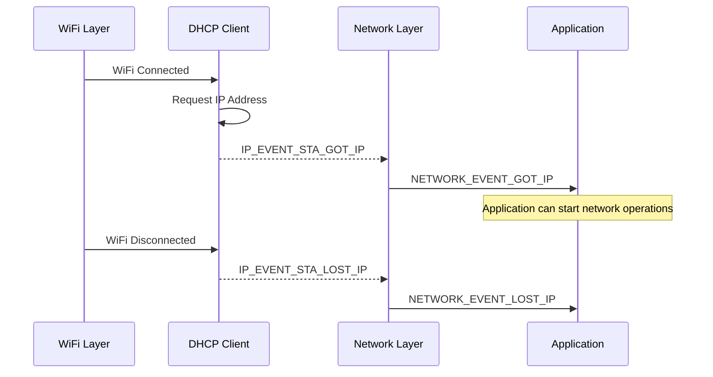

# IP Events: Understanding Network Layer

<div class="grid grid-cols-2 gap-8">

<div>

### IP Event Lifecycle



**Key Timing:**
- IP events happen **after** WiFi events
- DHCP negotiation takes additional time
- IP can be lost without WiFi disconnect

</div>

<div>

### IP Event Types & When They Occur

### IP_EVENT_STA_GOT_IP

### IP_EVENT_STA_LOST_IP  

### IP_EVENT_GOT_IP6

### Network Monitoring Strategy

**Monitor both layers independently:**
```
WiFi Status: Connected | Disconnected
IP Status:   Has IP    | No IP
```

### Production Considerations

- Handle IP loss during operations
- Automatic IP renewal attempts
- Pause/resume network services
- Accurate connectivity status reporting

</div>

</div>

