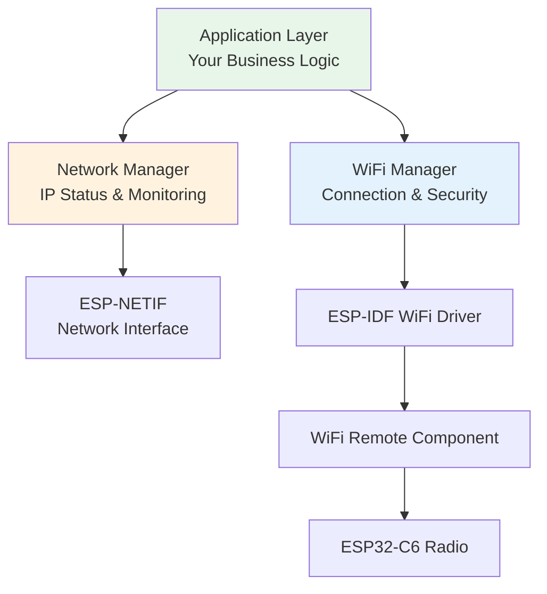

# Integration: System Architecture Overview

<div class="grid grid-cols-2 gap-8">

<div>

### Complete System Architecture



**Layered Responsibilities:**
- **Application**: Business logic, network operations
- **Network Manager**: IP events, status APIs
- **WiFi Manager**: Connection, authentication, retry logic
- **ESP-NETIF**: Hardware abstraction layer
- **ESP-IDF Driver**: Low-level WiFi operations

</div>

<div>

### Integration Principles

### Sequential Initialization
**Order matters for proper system startup:**
```
1. Base Systems (NVS, NETIF, Event Loop)
2. WiFi Manager (Configuration, Handlers)  
3. Network Manager (IP Event Monitoring)
4. Start Connection (Blocking until ready)
5. Application Logic (Network operations)
```

### Resource Lifecycle Management
```
Initialize → Configure → Start → Monitor → Cleanup
```

### Error Propagation
- **Initialization errors**: Fail fast, don't continue
- **Runtime errors**: Retry logic and graceful degradation
- **Cleanup errors**: Log but continue shutdown

### State Synchronization
- **WiFi events**: Asynchronous radio operations
- **IP events**: Asynchronous network operations
- **Application**: Synchronous, blocks until ready

</div>

</div>

### Benefits of Layered Architecture

- **Separation of Concerns**: Each layer has single responsibility
- **Testability**: Layers can be unit tested independently  
- **Maintainability**: Changes isolated to specific layers
- **Reusability**: Layers can be used in different projects
- **Debuggability**: Clear boundaries for troubleshooting