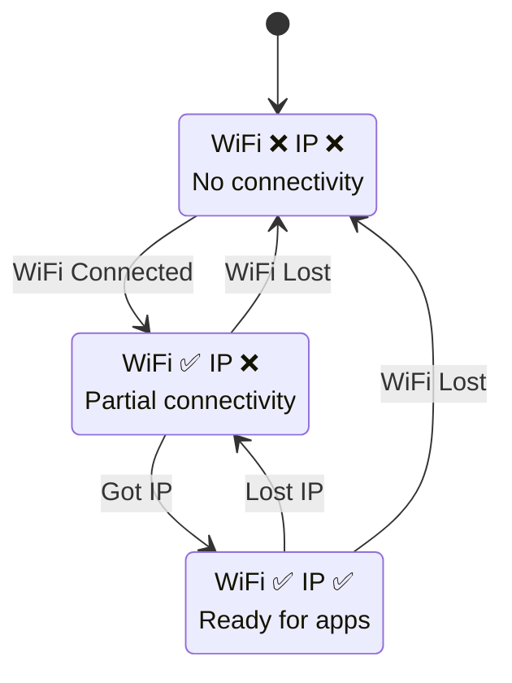

# Production Monitoring: Concepts

<div class="grid grid-cols-2 gap-8">

<div>

### Connection Health Monitoring

**Why Monitor After Connection?**
- Networks are dynamic and unreliable
- WiFi can disconnect at any time
- IP addresses can be lost
- Applications need to react to changes



### Connection States
1. **Fully Connected**: WiFi + IP = Ready
2. **Partial Connection**: WiFi only, no IP
3. **Disconnected**: No WiFi, no IP

</div>

<div>

### Monitoring Strategies

### Periodic Status Checks
**Approach:** Check connectivity every N seconds
```c
while (1) {
    check_connection_status();
    vTaskDelay(pdMS_TO_TICKS(30000)); // 30 seconds
}
```
**Pros:** Simple, predictable
**Cons:** Delayed reaction to changes

### Event-Driven Monitoring  
**Approach:** React immediately to connection changes
```c
void network_event_callback(network_event_t event, void *data) {
    switch (event) {
        case NETWORK_EVENT_GOT_IP:
            start_network_services();
            break;
        case NETWORK_EVENT_LOST_IP:
            pause_network_services();
            break;
    }
}
```
**Pros:** Immediate response
**Cons:** More complex implementation

### Hybrid Monitoring (Best)
- **Event-driven**: React to immediate changes
- **Periodic**: Verify state consistency
- **Health checks**: Active connectivity testing

</div>

</div>

### Application Integration Patterns

- **Service lifecycle management**: Start/stop services based on connectivity
- **Data buffering**: Queue operations during disconnection
- **User feedback**: Provide connection status to UI
- **Metrics collection**: Track connection quality and uptime